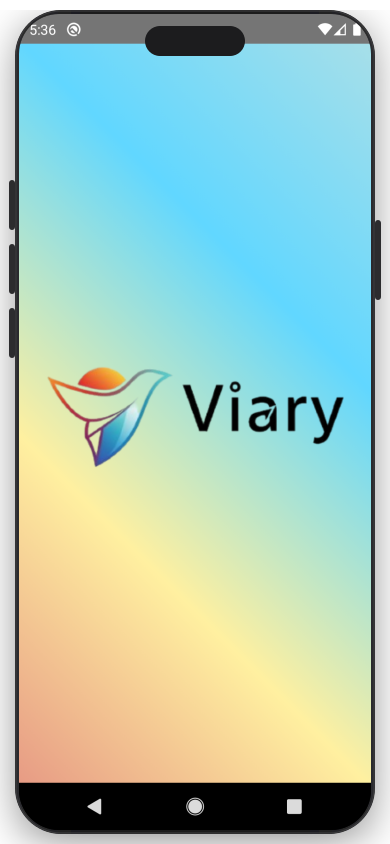
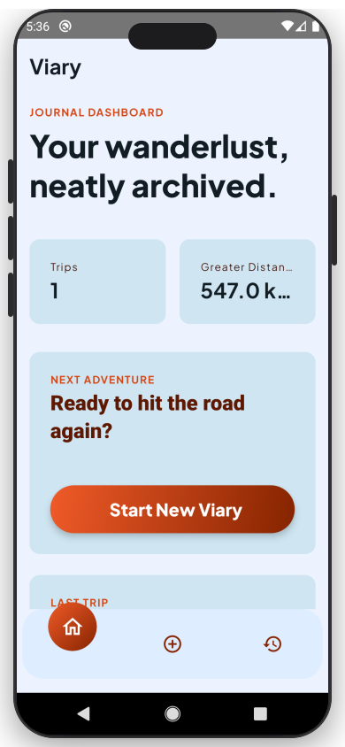
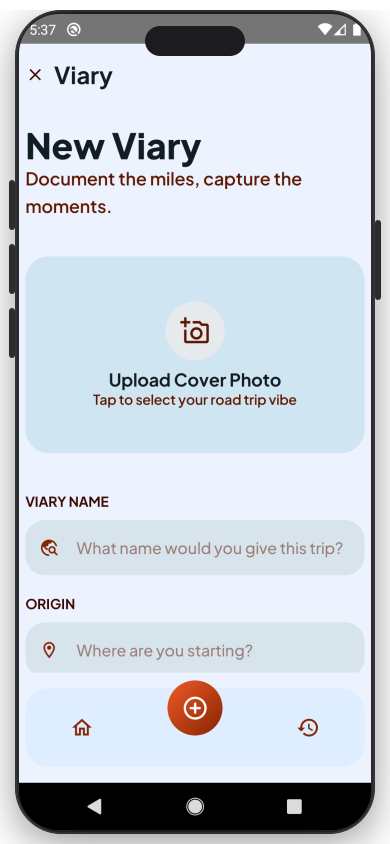
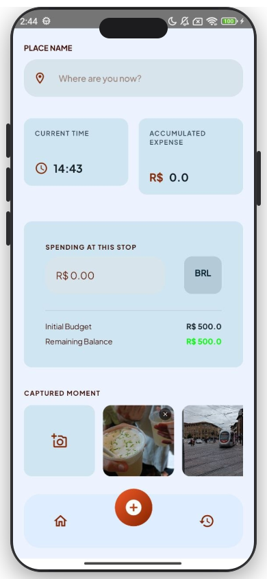
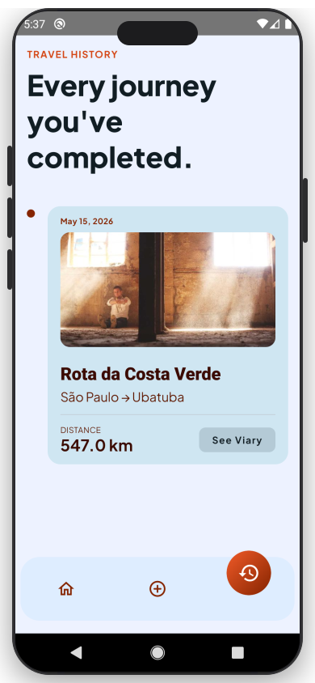
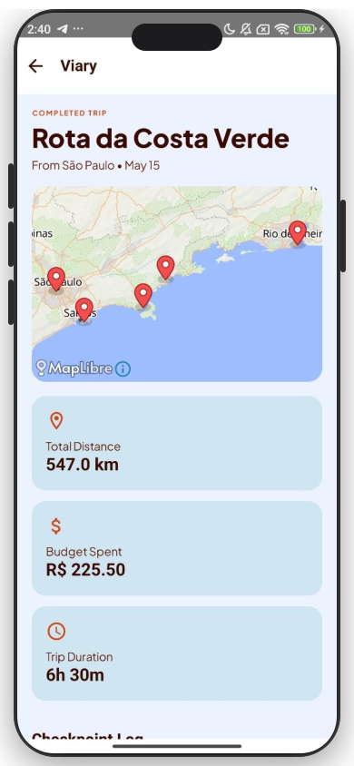

<p align="center">
  
</p>

<h1 align="center">Viary</h1>
<p align="center"><em>Seu diário de viagens. Cada parada, cada gasto, cada memória.</em></p>

<p align="center">
  
  
  
  
</p>

---

## Sobre o App

**Viary** é um aplicativo de diário de viagens para Android. A ideia é simples: você cria uma viagem, adiciona checkpoints ao longo do caminho — cada um com o local visitado, o valor gasto e fotos — e o app registra tudo automaticamente: distância percorrida via GPS, duração total e orçamento consumido.

Ao finalizar a viagem, você tem um relatório completo com mapa interativo da rota, timeline das paradas e galeria de fotos.

---

## Telas

<table>
  <tr>
    <td align="center">
      <br/>
      <b>Splash</b>
    </td>
    <td align="center">
      <br/>
      <b>Home</b>
    </td>
    <td align="center">
      <br/>
      <b>Criar Viagem</b>
    </td>
  </tr>
  <tr>
    <td align="center">
      <br/>
      <b>Checkpoint</b>
    </td>
    <td align="center">
      <br/>
      <b>Histórico</b>
    </td>
    <td align="center">
      <br/>
      <b>Detalhes</b>
    </td>
  </tr>
</table>

---

## Funcionalidades

### Viagens
- Crie uma viagem com nome, local de partida, orçamento inicial e foto de capa
- Escolha o clima da viagem (ensolarado, nublado, chuvoso, frio)
- Acompanhe o tempo decorrido e a distância percorrida em tempo real via GPS
- Finalize a viagem com um único toque

### Checkpoints
- Registre cada parada com nome do local, valor gasto e horário
- Adicione fotos da parada diretamente pela galeria
- Visualize o orçamento acumulado e o saldo restante antes de confirmar

### Mapa e Rota
- Visualize toda a rota no mapa interativo (MapLibre) ao concluir a viagem
- Marcadores para origem, cada checkpoint e destino final

### Estatísticas
- Total de quilômetros percorridos
- Duração completa da viagem
- Total gasto ao longo das paradas

### Detalhes Automáticos
- Detecção de país pelo IP para exibir o símbolo de moeda correto
- Galeria de fotos organizadas por parada

---

## Stack Tecnológica

| Camada | Tecnologia |
|---|---|
| Linguagem | Kotlin 2.2.21 |
| UI | Jetpack Compose + Material 3 |
| Arquitetura | MVI com BaseViewModel (StateFlow + Channel) |
| Navegação | Navigation Compose 2.9.6 |
| Banco de dados | Room 2.8.3 |
| Injeção de dependência | Koin 4.1.1 |
| Mapas | MapLibre Android 11.5.1 |
| Localização | Google Play Services Location 21.3.0 |
| Carregamento de imagens | Coil 2.7.0 |
| Permissões | Accompanist Permissions 0.37.3 |
| Testes | MockK 1.13.8 · Turbine 1.0.0 · Coroutines Test |

---

## Arquitetura

O projeto segue o padrão **MVI (Model-View-Intent)** com fluxo de dados unidirecional:

```
UI (Composables)
      │  Intent (ação do usuário)
      ▼
ViewModel (BaseViewModel<Intent, State, Effect>)
      │  StateFlow → UI State
      │  Channel  → Side Effects (navegação, erros)
      ▼
Repository
   ├── Room Database  (viagens e checkpoints locais)
   ├── LocationHelper (coordenadas GPS via FusedLocationProvider)
   └── HTTP (ip-api.com — detecção de país/moeda)
```

Cada tela tem seu próprio contrato (`*Contract.kt`) definindo os três tipos: `State`, `Intent` e `Effect`, mantendo o comportamento totalmente previsível e testável.

---

## Requisitos

- Android **7.0+** (API 24)
- Permissão de **localização** (necessária para rastreamento da rota)
- Acesso à **galeria** (para adicionar fotos nos checkpoints)

---

## Como executar (desenvolvimento)

```bash
git clone https://github.com/trian0/viary.git
```

Abra o projeto no **Android Studio Meerkat** (ou superior) e execute em um dispositivo ou emulador com API 24+.

---

## Licença

Distribuído sob a licença MIT. Veja `LICENSE` para mais detalhes.
